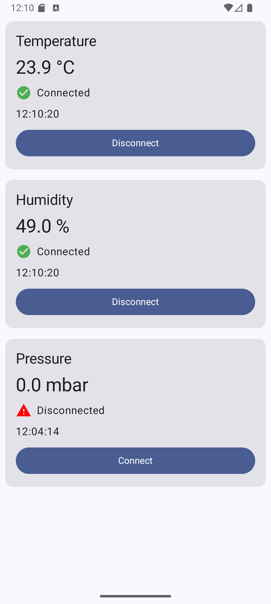
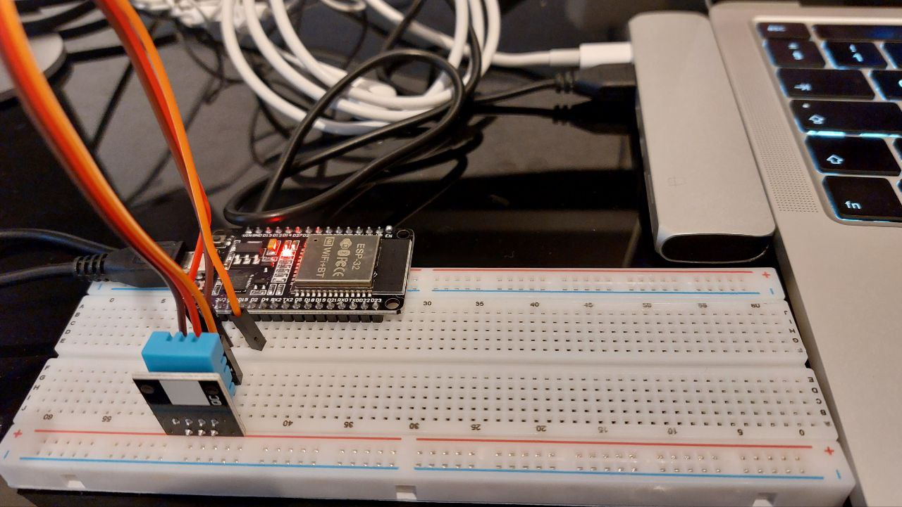
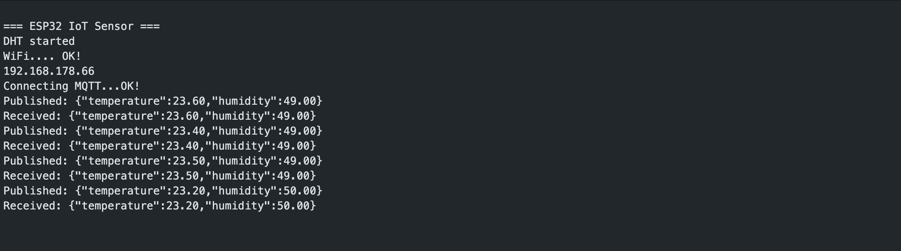

# Sensor IoT Dashboard

End-to-End for monitoring IoT sensors via MQTT, built with Jetpack Compose and modern Android architecture.

## Demo



*Real-time temperature and humidity monitoring with connection status*

### Hardware & Communication




*ESP32 with DHT11 sensor publishing data via MQTT*

## Project Structure

- **`/firmware`** - ESP32 sensor firmware (PlatformIO/C++)
- **`/app`** - Android monitoring application (Kotlin/Compose)

## Architecture
```
ESP32 + DHT11 Sensor
    ↓ WiFi
MQTT Broker (test.mosquitto.org)
    ↓ Subscribe
Android App (Jetpack Compose)
    ↓ StateFlow
UI Layer
```

## Features
- Real-time temperature and humidity monitoring from DHT11 sensor
- MQTT communication via public broker (test.mosquitto.org)
- Connection status indicators
- Manual sensor connect/disconnect controls
- Timestamp tracking for last update

## Tech Stack

### Firmware
- **Platform:** PlatformIO
- **Board:** ESP32 (ESP32-DevKit)
- **Language:** C++ (Arduino framework)
- **Protocol:** MQTT (Eclipse Paho)
- **Sensor:** DHT11 (temperature/humidity)

### Android
- **Language:** Kotlin
- **UI:** Jetpack Compose, Material 3
- **Architecture:** MVVM with clean separation
- **DI:** Hilt (Dagger)
- **Async:** Coroutines, Flow, StateFlow
- **IoT:** MQTT client (Eclipse Paho Android)

## Quick Start

### 1. ESP32 Firmware

```bash
cd firmware

# Configure WiFi credentials
cp src/credentials.h.example src/credentials.h
# Edit credentials.h with your WiFi SSID and password

# Build and upload (requires PlatformIO)
pio run --target upload

# Monitor serial output
pio device monitor
```

See [firmware/README.md](firmware/README.md) for detailed setup instructions.

### 2. Android App

```bash
# Build and run
./gradlew installDebug

# Or open in Android Studio
```

## Hardware Setup

**Components:**
- ESP32 development board
- DHT11 temperature & humidity sensor
- Breadboard and jumper wires

**Wiring:**
```
DHT11 VCC  → ESP32 3.3V
DHT11 Data → ESP32 GPIO4
DHT11 GND  → ESP32 GND
```

**MQTT Configuration:**
- Broker: test.mosquitto.org:1883
- Topic: `parissa/sensors`
- Message format: `{"temperature": 23.5, "humidity": 65.0}`

## Development

### Prerequisites

**Firmware:**
- [VS Code](https://code.visualstudio.com/) with [PlatformIO IDE](https://platformio.org/install/ide?install=vscode)
- ESP32 USB drivers (CH340/CP2102)

**Android:**
- Android Studio Hedgehog or later
- JDK 11+
- Android SDK API 24+

### Project Architecture

**Android (MVVM):**
```
UI Layer (Compose)
    ↓ observes
ViewModel (Hilt injected)
    ↓ collects
Repository Layer
    ↓ delegates to
MqttDataSource (callbackFlow)
```

## Learning Objectives

This project demonstrates:

1. **Modern Android Development**
    - Jetpack Compose for declarative UI
    - MVVM architecture with proper separation
    - Hilt for dependency injection
    - Coroutines & Flow for reactive programming

2. **IoT Integration**
    - MQTT protocol implementation
    - Real-time data streaming
    - Connection state management
    - Hardware-software integration

3. **Professional Tooling**
    - PlatformIO for embedded development
    - Git-based credential management
    - Clean project structure
    - Production-ready patterns

## Author

**Parissa Kalaee**  
Senior Embedded Systems & Android Engineer  
[LinkedIn](https://linkedin.com/in/parissakalaee)